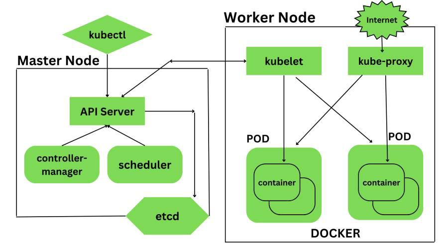
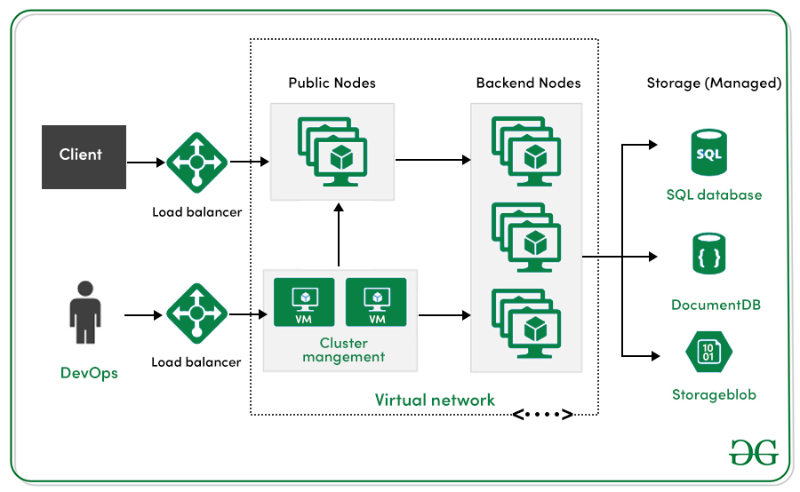
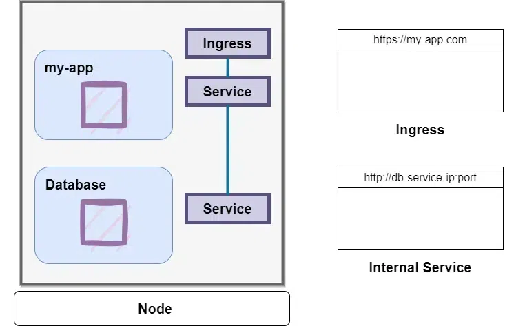
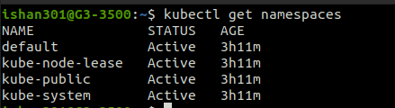
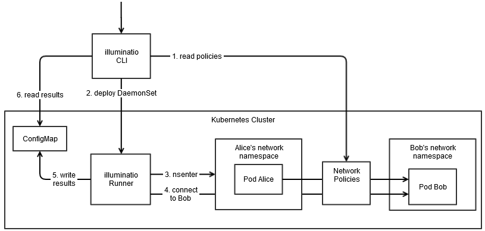
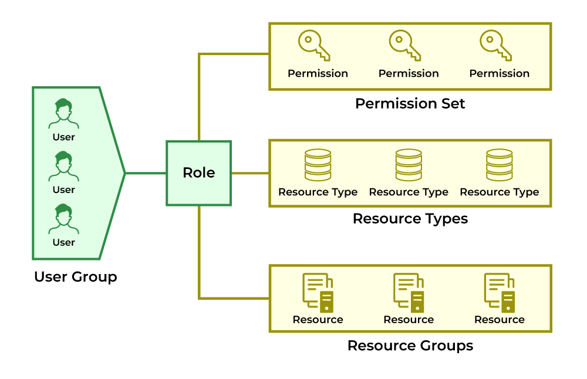

# <u>Fundamental Questions</u>

### What is Kubernetes?   
Kubernetes is an open-source container orchestration platform that automates the deployment, scaling, and management of containerized applications. It was originally developed by Google and is now maintained by the Cloud Native Computing Foundation (CNCF).

### What are the main components of Kubernetes architecture?   
The architecture consists of:
* Master Node: Manages the cluster and includes:  
    * API Server: Entry point for REST commands.  
    * etcd: Key-value store for configuration data.  
    * Controller Manager: Regulates the state of the cluster.  
    * Scheduler: Assigns tasks to nodes.  
* Worker Nodes: Run applications and contain:  
    * Kubelet: Ensures containers are running in Pods.  
    * Kube-proxy: Manages network rules for Pods.  
    * Container Runtime: Software that runs containers, such as Docker.  

### What is a Pod in Kubernetes?   
A Pod is the smallest deployable unit in Kubernetes, representing a single instance of a running process in a cluster. It can contain one or more containers that share the same network namespace and storage.

### What is a ReplicaSet?   
A ReplicaSet ensures that a specified number of replicas of a Pod are running at any time. It monitors the number of running Pods and creates or deletes them as necessary to maintain the desired state.

### Explain the role of etcd in Kubernetes.
etcd is a distributed key-value store used to store all cluster data, including nodes, Pods, and configurations. It provides consistency and availability of the Kubernetes cluster state.

# <u>Advanced Questions</u>

### How does Kubernetes handle networking?   
Kubernetes employs a flat network model where all Pods can communicate with each other regardless of their node location. Key networking features include:  
Cluster IP: Stable internal IP for services.  
NodePort: Exposes services on static ports for external access.  
LoadBalancer: Creates external load balancers.  

### What are some features of Kubernetes?   
Key features include:
Automated scheduling
Self-healing capabilities
Automated rollouts and rollback
Horizontal scaling and load balancing
Configuration management
Service discovery and networking.

### How does Kubernetes differ from Docker Swarm?   
While both are container orchestration tools, Kubernetes offers more robust features such as automated scaling, self-healing, and extensive community support, making it suitable for complex applications compared to Docker Swarm's simpler management capabilities.

## <u>Scenario-Based Questions</u>

### How would you approach migrating from a monolithic architecture to microservices using Kubernetes?   
The company should begin by containerizing each service incrementally, deploying them on Kubernetes while monitoring performance to ensure stability before fully transitioning all services.

### In a distributed system with multiple data centers, how can Kubernetes help manage tasks consistently?   
By utilizing Kubernetes' capabilities for scheduling, scaling, and managing multiple clusters, companies can achieve agility and efficiency across their distributed environments.

<b></hr></b>
===================================================================

1. What is Kubernetes?   
Kubernetes is an open-source container orchestration tool or system that is used to automate tasks such as the management, monitoring, scaling, and deployment of containerized applications.   
It is used to easily manage several containers (since it can handle grouping of containers), which provides for logical units that can be discovered and managed.

2. What are K8s?    
K8s is another term for Kubernetes. 

3. What is orchestration when it comes to software and DevOps?    
Orchestration refers to the integration of multiple services that allows them to automate processes or synchronize information in a timely fashion.  
Say, for example, you have six or seven microservices for an application to run.  
If you place them in separate containers, this would inevitably create obstacles for communication.  
Orchestration would help in such a situation by enabling all services in individual containers to work seamlessly to accomplish a single goal.  

4. How are Kubernetes and Docker related?   
Docker is an open-source platform used to handle software development.  
Its main benefit is that it packages the settings and dependencies that the software/application needs to run into a container, which allows for portability and several other advantages.  
Kubernetes allows for the manual linking and orchestration of several containers, running on multiple hosts that have been created using Docker.  

5. What are the main differences between the Docker Swarm and Kubernetes?   
Docker Swarm is Docker’s native, open-source container orchestration platform that is used to cluster and schedule Docker containers.  
Swarm differs from Kubernetes in the following ways:  

    * Docker Swarm is more convenient to set up but doesn’t have a robust cluster, while Kubernetes is more complicated to set up but the benefit of having the assurance of a robust cluster  
    * Docker Swarm can’t do auto-scaling (as can Kubernetes); however, Docker scaling is five times faster than Kubernetes   
    * Docker Swarm doesn’t have a GUI; Kubernetes has a GUI in the form of a dashboard   
    * Docker Swarm does automatic load balancing of traffic between containers in a cluster, while Kubernetes requires manual intervention for load balancing such traffic    
    * Docker requires third-party tools like ELK stack for logging and monitoring, while Kubernetes has integrated tools for the same  
    * Docker Swarm can share storage volumes with any container easily, while Kubernetes can only share storage volumes with containers in the same pod  
    * Docker can deploy rolling updates but can’t deploy automatic rollbacks; Kubernetes can deploy rolling updates as well as automatic rollbacks  

6. What is the difference between deploying applications on hosts and containers?   
    * Deploying Applications consist of an architecture that has an operating system.  
      The operating system will have a kernel that holds various libraries installed on the operating system needed for an application.

    * Whereas container host refers to the system that runs the containerized processes.  
      This kind is isolated from the other applications; therefore, the applications must have the necessary libraries.  
      The binaries are separated from the rest of the system and cannot infringe any other application.

7. What are the features of Kubernetes?   
Kubernetes places control for the user where the server will host the container.  
It will control how to launch. So, Kubernetes automates various manual processes. 
Kubernetes manages various clusters at the same time.  
It provides various additional services like management of containers, security, networking, and storage.  
Kubernetes self-monitors the health of nodes and containers.  
With Kubernetes, users can scale resources not only vertically but also horizontally that too easily and quickly.  

8. What are the main components of Kubernetes architecture?   
There are two primary components of Kubernetes Architecture: the master node and the worker node.  
Each of these components has individual components in them.

9. Explain the working of the master node in Kubernetes?   
The master node dignifies the node that controls and manages the set of worker nodes.  
This kind resembles a cluster in Kubernetes.  
The nodes are responsible for the cluster management and the API used to configure and manage the resources within the collection.  
The master nodes of Kubernetes can run with Kubernetes itself, the asset of dedicated pods.

10. What is the role of Kube-apiserver?   
This kind validates and provides configuration data for the API objects.  
It includes pods, services, replication controllers.  
Also, it provides REST operations and also the frontend of the cluster.  
This frontend cluster state is shared through which all other component interacts.

11. What is a node in Kubernetes?   
A node is the smallest fundamental unit of computing hardware.  
It represents a single machine in a cluster, which could be a physical machine in a data center or a virtual machine from a cloud provider.  
Each machine can substitute any other machine in a Kubernetes cluster.  
The master in Kubernetes controls the nodes that have containers. 

12. What does the node status contain?   
The main components of a node status are Address, Condition, Capacity, and Info.

13. What process runs on Kubernetes Master Node?    
The Kube-api server process runs on the master node and serves to scale the deployment of more instances.

14. What is a pod in Kubernetes?   
Pods are high-level structures that wrap one or more containers.  
This is because containers are not run directly in Kubernetes.  
Containers in the same pod share a local network and the same resources, allowing them to easily communicate with other containers in the same pod as if they were on the same machine while at the same time maintaining a degree of isolation.

15. What is the job of the kube-scheduler?   
The kube-scheduler assigns nodes to newly created pods.

16. What is a cluster of containers in Kubernetes?    
A cluster of containers is a set of machine elements that are nodes. 
Clusters initiate specific routes so that the containers running on the nodes can communicate with each other.  
In Kubernetes, the container engine (not the server of the Kubernetes API) provides hosting for the API server.

17. What is the Google Container Engine?   
The Google Container Engine is an open-source management platform tailor-made for Docker containers and clusters to provide support for the clusters that run in Google public cloud services. 

18. What are Daemon sets?   
A Daemon set is a set of pods that runs only once on a host.  
They are used for host layer attributes like a network or for monitoring a network, which you may not need to run on a host more than once.

19. What is ‘Heapster’ in Kubernetes?   
A Heapster is a performance monitoring and metrics collection system for data collected by the Kublet.  
This aggregator is natively supported and runs like any other pod within a Kubernetes cluster, which allows it to discover and query usage data from all nodes within the cluster.

20. What is Minikube?   
With the help of Minikube, users can Kubernetes locally.  
This process lets the user run a single-node Kubernetes cluster on your personal computer, including Windows, macOS, and Linus PCs.  
With this, users can try out Kubernetes also for daily development work.

21. What is a Namespace in Kubernetes?   
Namespaces are used for dividing cluster resources between multiple users.  
They are meant for environments where there are many users spread across projects or teams and provide a scope of resources.

22. Name the initial namespaces from which Kubernetes starts?   
Default
Kube – system
Kube – public

23. What is the Kubernetes controller manager?   
The controller manager is a daemon that is used for embedding core control loops, garbage collection, and Namespace creation.  
It enables the running of multiple processes on the master node even though they are compiled to run as a single process. 

24. What are the types of controller managers?   
The primary controller managers that can run on the master node are the endpoints controller, service accounts controller, namespace controller, node controller, token controller, and replication controller.

25. What is etcd?   
Kubernetes uses etcd as a distributed key-value store for all of its data, including metadata and configuration data, and allows nodes in Kubernetes clusters to read and write data.  
Although etcd was purposely built for CoreOS, it also works on a variety of operating systems (e.g., Linux, BSB, and OS X) because it is open-source.  
Etcd represents the state of a cluster at a specific moment in time and is a canonical hub for state management and cluster coordination of a Kubernetes cluster.

26. What are the different services within Kubernetes?   
Different types of Kubernetes services include: 

Cluster IP service
Node Port service
External Name Creation service and 
Load Balancer service
Earn the Most Coveted DevOps Certification!
DevOps Engineer Masters ProgramExplore ProgramEarn the Most Coveted DevOps Certification!

27. What is ClusterIP?   
The ClusterIP is the default Kubernetes service that provides a service inside a cluster (with no external access) that other apps inside your cluster can access. 

28. What is NodePort?    
The NodePort service is the most fundamental way to get external traffic directly to your service.  
It opens a specific port on all Nodes and forwards any traffic sent to this port to the service.

29. What is the LoadBalancer in Kubernetes?    
The LoadBalancer service is used to expose services to the internet.  
A Network load balancer, for example, creates a single IP address that forwards all traffic to your service. 

30. What is the Ingress network, and how does it work?   
An ingress is an object that allows users to access your Kubernetes services from outside the Kubernetes cluster.  
Users can configure the access by creating rules that define which inbound connections reach which services.

How does it work- This is an API object that provides the routing rules to manage the external users' access to the services in the Kubernetes cluster through HTTPS/ HTTP.  
With this, users can easily set up the rules for routing traffic without creating a bunch of load balancers or exposing each service to the nodes.

31. What do you understand by Cloud controller manager?     
You must have heard about Public, Private and hybrid clouds.  
With the help of cloud infrastructure technologies, you can run Kubernetes on them.  
In the context of Cloud Controller Manager, it is the control panel component that embeds the cloud-specific control logic.  
This process lets you link the cluster into the cloud provider's API and separates the elements that interact with the cloud platform from components that only interact with your cluster.   

This also enables the cloud providers to release the features at a different pace compared to the main Kubernetes project.  
It is structured using a plugin mechanism and allows various cloud providers to integrate their platforms with Kubernetes.  

32. What is Container resource monitoring?   
This refers to the activity that collects the metrics and tracks the health of containerized applications and microservices environments.  
It helps to improve health and performance and also makes sure that they operate smoothly.

33. What is the difference between a replica set and a replication controller?   
A replication controller is referred to as RC in short.   
It is a wrapper on a pod.    
This provides additional functionality to the pods, which offers replicas.  
It monitors the pods and automatically restarts them if they fail.  
If the node fails, this controller will respawn all the pods of that node on another node.  
If the pods die, they won't be spawned again unless wrapped around a replica set.  

Replica Set, on the other hand, is referred to as rs in short.  
It is told as the next-generation replication controller.  
This kind of support has some selector types and supports the equality-based and the set-based selectors.   
It allows filtering by label values and keys. To match the object, they have to satisfy all the specified label constraints.  

34. What is a headless service?   
A headless service is used to interface with service discovery mechanisms without being tied to a ClusterIP, therefore allowing you to directly reach pods without having to access them through a proxy.  
It is useful when neither load balancing nor a single Service IP is required. 

35. What are federated clusters?   
The aggregation of multiple clusters that treat them as a single logical cluster refers to cluster federation.  
In this, multiple clusters may be managed as a single cluster.  
They stay with the assistance of federated groups.  
Also, users can create various clusters within the data center or cloud and use the federation to control or manage them in one place.  
You can perform cluster federation by doing the following:  
    * Cross cluster that provides the ability to have DNS and Load Balancer with backend from the participating clusters. 
    * Users can sync resources across different clusters in order to deploy the same deployment set across the various clusters.

36. What is Kubelet?   
The kubelet is a service agent that controls and maintains a set of pods by watching for pod specs through the Kubernetes API server.  
It preserves the pod lifecycle by ensuring that a given set of containers are all running as they should.  
The kubelet runs on each node and enables the communication between the master and slave nodes.

37. What is Kubectl?   
Kubectl is a CLI (command-line interface) that is used to run commands against Kubernetes clusters.  
As such, it controls the Kubernetes cluster manager through different create and manage commands on the Kubernetes component.  

38. Give examples of recommended security measures for Kubernetes.
Examples of standard Kubernetes security measures include defining resource quotas, support for auditing, restriction of etcd access, regular security updates to the environment, network segmentation, definition of strict resource policies, continuous scanning for security vulnerabilities, and using images from authorized repositories.

39. What is Kube-proxy?    
Kube-proxy is an implementation of a load balancer and network proxy used to support service abstraction with other networking operations.  
Kube-proxy is responsible for directing traffic to the right container based on IP and the port number of incoming requests.

40. How can you get a static IP for a Kubernetes load balancer?    
A static IP for the Kubernetes load balancer can be achieved by changing DNS records since the Kubernetes Master can assign a new static IP address.


<hr>
<hr>

1. Explain Kubernetes Architecture?  
Kubernetes is an open-source container deployment and administration platform.  
It offers container orchestration, container runtime, container-centric infrastructure orchestration, balance of load, self-healing mechanisms, and service discovery.  
A Kubernetes cluster has several control planes and one or more worker nodes.


Kuberenets Architecture  

2. Explain the concept of Container Orchestration?  
Container orchestration is a tool that developers may use anywhere there are containers to automate the life cycle management of the containers.  
It provides a automatic deployment, scaling, and management of containerized applications so that the developers do not have any worry about that the underlying infrastructure.


Container Orchestration

3. What is a Pod in Kubernetes?  
A cluster of one or more Linux containers makes up a Kubernetes pod, the smallest unit of a Kubernetes application.  
From the more common scenario of a single container to an advanced use case with numerous tightly coupled containers within a pod, this basic structure allows for an array of designs.

kubectl get pods -n <namespace-name>

4. How does Kubernetes handle container scaling?  
To automatically scale the workload to match demand, a Horizontal Pod Autoscaling in Kubernetes updates a workload resource (such a deployment or stateful set).  
Horizontal scaling indicates that more pods are added in response to an increase in load.  
```bash
apiVersion: autoscaling/v2beta2
kind: HorizontalPodAutoscaler
metadata:
name: my-hpa
spec:
  scaleTargetRef:
  apiVersion: apps/v1
  kind: Deployment # or StatefulSet, or ReplicaSet, depending on your workload
  name: my-deployment
  minReplicas: 3
  maxReplicas: 5
  metrics:
    - type: Resource
  resource:
  name: cpu
  target:
  type: Utilization
  averageUtilization: 65
```

5. What is Kubelet?  
Kubelet is an important component of Kubernetes that manages containers within pods on a node.  
It registers the node with the control plane and provides resource information.  
Kubelet keeps an eye on container health and responds to problems—lik isnces of pods that contain a containerized application.  
Deployments can help to efficiently scale the number of replica pods, enable the rollout of updated code in a controlled manner, or roll back to the earlier deployment version if necessary.

```bash
apiVersion: apps/v1
kind: Deployment
metadata:
name: my-nginx
spec:
selector:
matchLabels:
app: nginx
template:
metadata:
labels:
app: nginx
spec:
containers:
- name: my-nginx
image: nginx:latest
resources:
limits:
memory: "125Mi"
cpu: "750m"
ports:
- containerPort: 80
```

7. Explain the difference between a StatefulSet and a Deployment.  
* StatefulSet:
  A collection of identical stateful pods are handled by the resource is called StatefulSet.	
  This resource controls identical pods deployment.
* Deployment:
  Statefulset helpful in managing stateful applications that need persistent storage with a dependable network ID.	
  It enables you to control your application's state and ensure that the right number of replicas are always running.

8. What is a Service in Kubernetes?  
The idea of the Service is to group a set of Pod endpoints into a single resource.  
We can configure various ways to access the grouping.  
By default, we can get a stable cluster IP address that the clients inside the cluster can use to contact Pods in Service.
```bash
apiVersion: v1
kind: Service
metadata:
name: my-service
spec:
selector:
Tomcat: deploymentapp
ports:
- protocol: TCP
port: 80
targetPort: 8080
```

9. How does Kubernetes manage configuration?  
Kubernetes employs ConfigMaps and Secrets to manage configuration.  
ConfigMaps store non-sensitive setup data, while Secrets handles sensitive information like passwords.  
These resources have different configurations from the application code, making updates easier.  
ConfigMaps have key-value pairs for different settings that can be accessed as environment variables or mounted files.  
Sensitive data is securely stored in Secrets, which are applied to the cluster using kubectl.  
Both ConfigMaps and Secrets are defined in YAML files and applied to the cluster using kubectl.  
Kubernetes tracks changes in these resources, triggering updates in Pods without needing changes to the application code.

10. Describe the role of a Master node in Kubernetes.  
Kubernetes master node components can be run within Kubernetes itself, as a set of containers within the dedicated pod.  
The master node is responsible for cluster management and for providing the API that is used to configure and manage resources within the Kubernetes cluster.

11. What is the role of the kube-proxy in Kubernetes and how does it facilitate communication between Pods?  
The networking part of Kubernetes that enables communication between pods & services is called Kube-proxy, and it may be installed on any cluster node.  Its major function is to maintain network rules for service-to-pod mapping, which provides communication to and from Kubernetes clusters.

## Intermediate Kubernetes Interview Questions

12. Explain the concept of Ingress in Kubernetes.  
In the following section, we will go across what Kubernetes Ingress is, what an Ingress controller is, how it fixes routing difficulties, and how to implement it step-by-step.  
Ingress is a Kubernetes API object that is used to expose HTTP and HTTPS routes from outside the cluster to services inside the cluster.  
It provides a single entry point into a cluster, it allows more straightforward management applications and troubleshooting routing issues.
 

Kubernetes-Ingress

13. What is a ConfigMap?
A ConfigMap is an API object in Kubernetes that is primarily used to store non-confidential data. ConfigMaps are a way for Kubernetes to inject configuration data into application pods, making it easier to manage and update configuration settings and assist in separating configuration from application code.

apiVersion: v1
kind: Pod
metadata:
name: my-pod
spec:
containers:
- name: container-name
image: image
volumeMounts:
- name: volume-name
mountPath: /etc/configmap
volumes:
- name: volume-name
configMap:
name: configmap-name

14. Describe the role of etcd in Kubernetes.  
Etcd is the cluster brain that maintains records of all cluster information, which includes the desired state, the current state, resource configurations, and runtime data.  
It is the cluster brain that informs other processes that including the Scheduler about changes in the cluster state and availability of resources.

15. How do rolling updates work in a Deployment?  
The rolling update deployment strategy, additionally referred to as a rolling deployment, makes sure of zero downtime by methodically replacing out of date Pods with updated ones, facilitating a smooth transition during Deployment updates.  
A rolling deployment is a strategic approach that gradually substitutes older versions of an application with newer ones through an overall replacement of the underlying infrastructure.

16. What is a Namespace in Kubernetes?  
Namespaces permit Kubernetes clusters to be organized into virtual sub-clusters, which is useful in situations where a cluster is utilized by several teams or projects.  
Namespaces allow a cluster to be structured in any number of ways, with each namespace providing logical segregation from the others while maintaining the ability to speak across namespaces.  


Kubernetes Namespace

17. Explain the use of Labels and Selectors in Kubernetes.
Labels and Selectors are essential sections in Kubernetes configuration files for deployments and services due to how they link Kubernetes services to pods.  
Labels are key-value pairs that identify pods distinctly;  
the deployment assigns these labels and uses them as a starting point for the pod prior to its creation, and the Selector matches these labels.  
Labels and selectors combine to create connections between deployments, pods, and services in Kubernetes.

18. Describe the role of a Proxy in Kubernetes.
One essential Kubernetes agent that exists on every cluster node is called Kube-Proxy.  
Its primary function is to keep track of modifications made to the Service of objects and the endpoints that correspond to them.  
It then changes these modifications into actual network rules that are implemented into the node.

19. What is a Persistent Volume (PV) in Kubernetes?
A Persistent Volume (PV) in Kubernetes is an object that allows pods to access storage from a defined device.  
This device is usually described via a Kubernetes StorageClass.  
When a PVC is created individually, it is generated and designated to the specified storage device.  
This method wins out over pretreated storage classes because it gives a better understanding of the workflow.

apiVersion: v1

kind: PersistentVolume

metadata:

name: mypv

spec:

capacity:

storage: 2Gi

accessModes:

- ReadWriteOnce

persistentVolumeReclaimPolicy: Retain

hostPath:

path: "/mnt/data"

20. Explain the differences between a DaemonSet and a ReplicaSet.
ReplicaSet

DaemonSet

On any node, ReplicaSet will make sure that the number of operating pods in the Kubernetes cluster match the number of pods that is planned.	Every node will have just the minimum of one pod of the application that we deployed because of DaemonSet.
Replicaset most suitable for applications like web applications which are stateless.	Stateful applications are best fits for it.
21. How can you achieve communication between Pods in different Nodes?
Pods in a cluster of k8s can speak to one another by default use the internal IP addresses. The underlying container runtime or network plugin gives a virtual network overlay to this communication.

22. What advantages does Kubernetes have?
Kubernetes has the following advantages:

Container Orchestration
Automated Load Balancing
Auto Scaling
Rolling Update & Rollbacks
Service Discovery and Load Balancing
Storage Orchestration
Self-Healing
Secrets and Configuration Management
Multi-Cloud and Hybrid Cloud Support
Role-Based Access Control (RBAC)
Pods and Multi-Container Support
Monitoring and Logging
Also Read: Fundamental Kubernetes Components

Advanced Kubernetes Interview Questions
Kubernetes-Interview-Questions-and-Answers
Kubernetes Interview Questions and Answers
23. What is the role of the kube-scheduler in Kubernetes?
This Kubernetes scheduler, a control plane mechanism, is in charge of assigning Pods to Nodes; it evaluates constraints and readily accessible assets to identify acceptable candidate Nodes for each Pod in the scheduling queue. Kube-scheduler, the default scheduler for Kubernetes, works within the control plane and is intended to provide users with the option to develop and implement their custom scheduling components.

24. Describe how a Horizontal Pod Autoscaler (HPA) works.
With a dedicated instance for each workflow, each configured Horizontal Pod Autoscaler works as part of a control loop, automatically changing the workloads' shape to maintain the desired state by periodically contrasting its metrics to the user-configured target thresholds.

apiVersion: autoscaling/v2

kind: HorizontalPodAutoscaler

metadata:

name: webserver-mem-hpa

spec:

maxReplicas: 5

minReplicas: 1

scaleTargetRef:

apiVersion: apps/v1

kind: Deployment

name: webserver

metrics:

- type: Resource

resource:

name: memory

target:

type: Utilization

averageValue: 2Mi

25. Explain the concept of Custom Resources in Kubernetes.
Following a custom resource is installed, users can create and access its objects using kubectl, just like they do for built-in resources like Pods. A custom resource is an extension of the Kubernetes API that is not always available in a default Kubernetes installation. However, many core Kubernetes functions are now built using custom resources, making Kubernetes more modular. Custom resources can come and go in a running the cluster through dynamic registration, and cluster admins can update custom resources independently of the cluster.

26. How does Kubernetes handle security and access control?
Using robust access restrictions and encryption techniques, like Kubernetes Secrets or external key management systems, can help safeguard sensitive data kept within your cluster. To prevent unwanted access, data must be encrypted as it is in transit and at rest.

27. What is a Network Policy in Kubernetes?
Kubernetes Network Policies are an application-centric build that let you specify how pod is allowed to communicate with various network "entities" (we use the term "entity" here to avoid over change the more common terms such as "endpoints" and "services", which have specific K8s connotations) over the network. Network Policies apply to the connection with pod on one or both sides, and are not relevant to any other connections.



28. Describe the role of a kube-proxy in the cluster.
Kube-Proxy is an important Kubernetes agent that stays on every cluster node. Its main function is to keep track of adjustments made to Service objects and the endpoints that correspond to them. Based on the changes made, it switches them into concrete network rules on the node.

29. What is a Helm chart, and how is it used?
Helm utilizes a packaging format called charts, which are collection of files which describe the cohesive set of Kubernetes resources. Whether you are deploying a simple component, like a memcached pod, or a complex web app stack which involves HTTP servers, databases, caches, and more, all the files you need are contained in a single chart. Helm chart packages provide all the resources you need to deploy an application to a Kubernetes cluster, which involves YAML configuration files for secrets, services, deployments, and config maps that provide the app's desired state.

30. Explain the concept of Taints and Tolerations in Kubernetes.
Tolerances, when applied to pods, enable the scheduler to schedule them in the presence of matching taints. However, tolerating a pod does not ensure scheduling, as the scheduler considers other factors when making its decision. Node affinity is a property of Pods that either expresses a preference or sets a hard requirement to attract them to a specific set of nodes. Taints, on the other hand, work as the opposite, allowing a node to repel a specific group of pods.

apiVersion: v1

kind: Pod

metadata:

name: nginx

labels:

env: test

spec:

containers:

- name: nginx

image: nginx

imagePullPolicy: IfNotPresent

tolerations:

- key: "example-key"

operator: "Exists"

effect: "NoSchedule"

31. How does Kubernetes manage storage orchestration?
The Container Storage Interface (CSI) is the standard to establish device-independent relationships across block and file storage systems and containerized workloads. In essence, CSI allows storage interfaces to be declared to be implemented by containers.

32. Describe the use of init containers in Kubernetes.
This page provides an overview of init containers, which are specialized containers that carry out in front of app containers in a Pod. You can specify init containers in the Pod specification as well as to the containers array (which describes app containers). Init containers can contain utilities or setup scripts that aren't present in an app image. Resource limitations, volumes, and security settings are just a few of the characteristics and functions that app containers support in it containers.

33. In Kubernetes, what are the various services available?
Kubernetes supports a number of services, include the following: 1) Cluster IP, 2) Node Port, 3) Load Balancer, & 4) External Name Creation.

1. Cluster IP Service
A ClusterIP service in Kubernetes provides a stable virtual IP address (Cluster IP) to the service, allowing internal communication between various parts in the Kubernetes cluster, it exposes a set of Pods within the cluster to other objects in the cluster.

2. Node Port Service
A NodePort service in Kubernetes is a type of service that allows a group of Pods accessible to external customers on an allocated port on all cluster nodes.

3. Load Balancer service
An external load balancer is automatically provided by a LoadBalancer service in Kubernetes to distribute incoming traffic between the Pods when a group of Pods are accessible to the outside world.

4. External Name Creation Service
An ExternalName service in Kubernetes works as an alias which allows pods inside the cluster to contact services outside cluster using a user-defined DNS name. External name provides DNS-based service discovery to map a service to an external DNS name.

Also Read: Kubernetes - Images

Kubernetes Interview Questions For Experienced
34. Explain the concept of a Custom Operator in Kubernetes.
Utilizing the Kubernetes API, operators automate procedures like application deployment, scaling, and governance, offering a smooth and integrated approach to resource management. Operators usually set up as custom controllers and extend the Kubernetes API with new resources and specialized logic for their management.

35. Describe the internals of the Kubernetes control plane.
Worker nodes, pods, and other cluster resources are administered by the Kubernetes control plane. It receives data regarding cluster activity, requests from both internal and external sources, and various other things. Then, it applies this information to move the cluster resources from their current state to the desired state.

36. What is the purpose of the Kubernetes API server?
As the front end to the cluster's shared state, the API server manages REST operations and serves as the hub through which all other components communicate. Its main responsibility is to receive and handle HTTP requests in the form of API calls, which come from consumers or other Kubernetes system components. The Kubernetes API server is crucial to the validation as well as the configuration of data for different API objects, including pods, services, replication controllers, and more.

37. How does Kubernetes handle rolling back deployments?
In Kubernetes, you can roll back a deployment using the `kubectl rollout} command. This command provides an array of options to control rollbacks, like `kubectl rollout undo`, which flips back the current deployment to the previous revision. You can also use the `--to-revision} flag to specify a specific revision.

kubectl rollout undo deployment <deployment-name>

kubectl rollout undo deployment <deployment-name> --to-revision=<revision-number>

38. Explain the concept of Pod Disruption Budgets.
It is intended for application owners who want to build highly available applications and also serves as a guide for cluster administrators who are building automated cluster actions such as autoscaling and upgrades. Pod disruption budgets, or PDBs for short, are policies that specify the desired state of the cluster and the orchestrators' attempt to maintain it. For PDBs, this consists of defining a maximum quantity of failed pods or the lowest number of pod replicas that must stay in the cluster at any given time.

39. What is the role of the kube-controller-manager?
As a daemon, the Kubernetes controller manager incorporates all of the basic control loops that make up Kubernetes. A control loop in robotics and automation is an ongoing mechanism that manages the state of the system. In Kubernetes, a controller is a control loop that keeps an eye on the cluster's shared state through the api server and makes modifications to bring the current state into line with the desired state. Some of the controllers that come packaged with Kubernetes are the replication controller, endpoints controller, namespace controller, and service accounts controller.

40. Describe the role of kube-apiserver in the Kubernetes architecture.
The frontend to the cluster's shared state which all other components interact with is the Kubernetes API server. It handles REST operations, validation of data and configuration of various API objects like pods, services, and replication controllers, and provides an encompassing interface for managing the cluster's overall state and allowing communication with all components.

41. How does Kubernetes handle node failures and resiliency?
Whenever a node fails or a container becomes hazardous, Kubernetes makes sure that a sufficient amount of replicas is maintained by launching new replicas on numerous servers, which maintains continuous availability.

Here are some key mechanisms and strategies that Kubernetes employs:

Node Health Monitoring
Pod Restart Policies
Replication and Desired State
Pod Disruption Budgets
Node Pools and Multi-Cloud Deployments
42. Explain how to set up and use Role-Based Access Control (RBAC) in Kubernetes.
Initially choose a few broad user categories and the degree of access that each one needs. These choices will be based on the method of authentication you decide as well as the demands of your organization. After you have made the decisions, you can set up role bindings for every group of user.



43. What is the role of the Cloud Controller Manager in a cloud-based Kubernetes cluster?
The cloud-controller-manager, a crucial Kubernetes control plane component, encapsulates cloud-specific control logic. This manager facilitates the integration of your cluster with the API of your cloud provider, effectively segregating components that interact with the cloud platform from those that solely interact with the Kubernetes cluster. As part of its capabilities, the cloud controller manager regulates the Node controller, which is in charge of tasks like removing deleted Kubernetes nodes from the cloud environment and setting up cloud infrastructure technologies.

44. Describe a few important Kubectl commands.
The following are important Kubectl commands:

kubectl api-resources
kubectl autoscale
kubectl annotate
kubectl cluster-info
kubectl attach
kubectl apply
kubectl update
kubectl edit
kubectl config set
kubectl config
kubectl config current-context.
45. What is Helm of Kubernetes?
Helm is a package manager for Kubernetes that makes application deployment and management more simple. By providing a templating system, parameterization, and versioning for Kubernetes manifests, Helm increases deployment process and makes it possible to define, install, and upgrade even the most complex Kubernetes applications using the pre-configured packages called "charts."

Helm's main features are as follows:

Charts
Templating
Repositories
Reusability
Parameterization
Dependency Management
Release Management
Other Important Topics Related To Kubernetes For Interview
Below is a table for the important topics related to Kubernetes that are important for interviews:

Topic

Description

1. Kubernetes	An open-source container orchestration tool/system used for automating tasks like management, monitoring, scaling, and deployment of containerized applications.
2. K8s	Another term for Kubernetes.
3. Orchestration	Integration of multiple services to automate processes or synchronize information. In the context of Kubernetes, orchestration ensures seamless communication among individual containers.
4. Architecture	Understanding Kubernetes components: master node, worker nodes, etcd, API server, controller manager, and scheduler.
5. Pods	The basic unit in Kubernetes, containing one or more containers.
6. Services	Exposing pods to the network. Types: ClusterIP, NodePort, Load Balancer, and ExternalName.
7. Replication Controllers	Ensuring a specified number of replicas of a pod are running.
8. Deployments	Managing rolling updates and rollbacks.
9. ConfigMaps and Secrets	Managing configuration data and sensitive information.
10. Persistent Volumes (PVs) and Persistent Volume Claims (PVCs)	Managing storage for stateful applications.
11. Ingress Controllers	Routing external traffic to services within the cluster.
12. Helm	Package manager for Kubernetes.
13. Security	RBAC, Network Policies, and Pod Security Policies.
14. Monitoring and Logging	Prometheus, Grafana, and ELK stack.
15. Troubleshooting	Diagnosing issues with pods, services, and nodes.
