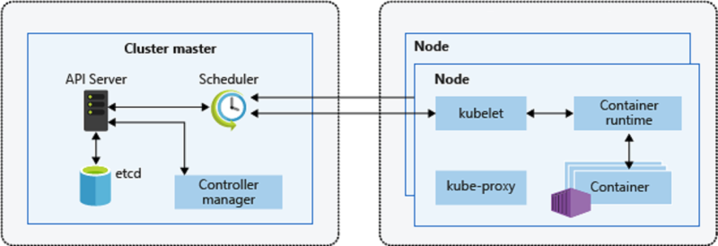

## Kubernetes Architecture

k8s is a distributed architucture with master and worker nodes

Master Node has cluster master but looks as one single system.

What is kubernetes?
Kubernetes an open-source container orchestration platform designed to automate the deployment, management, and scaling of containerized applications.

Why to use kubernetes?
Docker can be used to create and manage containers, it lacks several features that Kubernetes provides for orchestrating those containers effectively:
    * Container Orchestration: 
        Docker does not have built-in orchestration capabilities like Kubernetes. 
        While Docker Swarm offers some orchestration features, it is less robust than Kubernetes.
    * Scaling and Load Balancing: 
        Kubernetes automatically scales applications based on traffic and load. 
        Docker requires additional tools or manual intervention to achieve similar functionality.
    * Service Discovery: 
       Kubernetes provides built-in service discovery mechanisms that allow containers to communicate with each other seamlessly. 
        Docker lacks this level of integration.
    * Health Monitoring: 
        Kubernetes continuously monitors the health of containers and can automatically restart or replace unhealthy instances. 
        Docker does not have this capability natively.

Kubernetes Architecture:
K8s is a Distributed system architucture.
It's a master and worker type

  
  

 
Master Node:
    * API Server (We communicate with api server)
    * etcd (executable directory/ database)
    * Controller manager()
    * Scheduler (Responsible for creating new work loads)

Node / Worker Node
     * Kubelet(is an agent that is responsible for executing commands sent from scheduler)
     * Container runtime(responsible for creating the container)
     * kube-proxy (responsible for network)

Ways to handle Containers in Kubernetes

Kubernetes Workload:
	What all we can do in Kubernetes.

## Pod
A pod is the smallest unit of computing that can be deployed and managed in Kubernetes.
A pod has one or more container in it.
Every pod gets its own ipAddress.

K8s setup

CRI - container runtime interface
CNI
CSI 
  
## Manual Steps for understanding k8s working  
- First we need to have 1 system for Master and others for Nodes (Pods)  
1. Install docker in all machines.
2. install cri-dockerd in master machine.
	* CRI-Dockerd serves as an open-source adapter that allows Docker Engine to interface with Kubernetes through the Container Runtime Interface (CRI).
	* [CRI-dockerd releases page](https://github.com/Mirantis/cri-dockerd/releases)
3. We now install kubeadm, kubectl and kubelet on all nodes
4. 

Kubernetes Major workloads:
* Pod
	* Pods will have containers
* Controllers:
	

K8s Manifest:
Writing a pod file in yaml:

---
apiVersion: v1
kind: Pod
metadata:
  name: hello-pod
spec:
  Container:
    - image: nginx:1.27 

We execute this above manifest with **"kubectl apply -f filename"**
We can run **"kubectl get pods"**
**kubectl get pods  -o wide** to view more information about the pods.

For all the resources we use **kubectl api-resources**

**kubectl exec podname -- printenv**  to display the environment variables 
**kubectl exec podname -- /bin/sh** tp execute commands inside the container.

